# ctms-ms Overview

The CTMS (Crypto Trading Management System) is a robust, microservices-based architecture designed for efficient and scalable cryptocurrency trading. It leverages modern development practices to ensure flexibility, maintainability, and high performance. Below is a brief introduction to the key components of the CTMS system:

## Components

1. **ctms-gateway**
   - **Function**: Handles request routing, load balancing, and authentication.
   - **Role**: Acts as the entry point for all client requests, ensuring secure and efficient distribution of traffic to downstream services.

2. **ctms-db**
   - **Function**: Manages data storage for user profiles, trade records, and market data.
   - **Role**: Provides reliable and high-performance storage solutions to support the system's data-intensive operations.

3. **ctms-task**
   - **Function**: Executes task scheduling, quantitative trading strategies, and automated trading operations.
   - **Role**: Facilitates the implementation of complex trading algorithms and ensures timely execution of trading tasks.

4. **ctms-admin**
   - **Function**: Provides user management, permission allocation, system configuration, data backup, and real-time analytics.
   - **Role**: Offers comprehensive administrative tools, including real-time K-line charts and multi-account trading capabilities, to support efficient management and monitoring.

5. **ctms-core**
   - **Function**: Processes core business logic, manages WebSocket communication, and handles real-time data processing.
   - **Role**: Serves as the backbone of the system, ensuring seamless real-time data flow and core functionality.

## Benefits

- **Scalability**: The microservices architecture allows for easy scaling of individual components to meet varying demands.
- **Flexibility**: Each service can be developed, deployed, and updated independently, facilitating rapid iteration and innovation.
- **Reliability**: Decoupled services reduce the risk of system-wide failures and improve overall stability.
- **Performance**: Asynchronous processing and efficient data handling ensure low latency and high throughput.

## Conclusion

CTMS is a powerful tool for both individual traders and professional trading teams, offering a comprehensive suite of features tailored to the needs of modern cryptocurrency trading. Its modular design ensures high scalability, flexibility, and reliability, making it an ideal choice for navigating the dynamic world of crypto markets.

# Architecture

```mermaid
graph TD
    A[CTMS] --> B[ctms-gateway]
    A --> C[ctms-db]
    A --> D[ctms-task]
    A --> E[ctms-admin]
    A --> F[ctms-core]

    B --> B1[Request Forwarding]
    B --> B2[Load Balancing]
    B --> B3[Authentication]

    C --> C1[User Data Storage]
    C --> C2[Trade Record Storage]
    C --> C3[Market Data Storage]

    D --> D1[Task Scheduling]
    D --> D2[Quantitative Strategy Execution]
    D --> D3[Automated Trading Operations]

    E --> E1[User Management]
    E --> E2[Permission Allocation]
    E --> E3[System Configuration]
    E --> E4[Data Backup & Recovery]
    E --> E5[Data Statistics & Analysis]
    E --> E6[Real-time K-line Charts]
    E --> E7[Multi-Account Trading]

    F --> F1[Core Business Logic]
    F --> F2[WebSocket Server]
    F --> F3[Real-time Data Processing]

    style A fill:#f9f,stroke:#333,stroke-width:2px
    style B fill:#bbf,stroke:#333,stroke-width:2px
    style C fill:#bbf,stroke:#333,stroke-width:2px
    style D fill:#bbf,stroke:#333,stroke-width:2px
    style E fill:#bbf,stroke:#333,stroke-width:2px
    style F fill:#bbf,stroke:#333,stroke-width:2px
```

### Architecture Diagram Description:
1. **CTMS** is the overarching system that integrates all components.
2. **ctms-gateway**:
   - **Request Forwarding**: Redirects user requests to the appropriate service modules.
   - **Load Balancing**: Distributes request traffic efficiently to ensure system performance.
   - **Authentication**: Verifies user identities and permissions to ensure request legitimacy.
3. **ctms-db**:
   - **User Data Storage**: Stores user profiles and permission data.
   - **Trade Record Storage**: Keeps detailed records of all trading operations.
   - **Market Data Storage**: Stores market data for use in trading strategies.
4. **ctms-task**:
   - **Task Scheduling**: Manages scheduled and asynchronous tasks.
   - **Quantitative Strategy Execution**: Implements user-defined trading strategies.
   - **Automated Trading Operations**: Automatically monitors the market and executes buy/sell orders.
5. **ctms-admin**:
   - **User Management**: Manages user accounts and permissions.
   - **Permission Allocation**: Assigns different operational permissions to users.
   - **System Configuration**: Configures system parameters and operating environments.
   - **Data Backup & Recovery**: Ensures data security and recoverability.
   - **Data Statistics & Analysis**: Monitors system performance and trading data in real-time.
   - **Real-time K-line Charts**: Provides real-time market analysis through K-line charts.
   - **Multi-Account Trading**: Supports trading operations across multiple accounts.
6. **ctms-core**:
   - **Core Business Logic**: Handles the core business processes of the system.
   - **WebSocket Server**: Manages real-time communication with clients.
   - **Real-time Data Processing**: Processes and distributes real-time data to other components.

### flowchart for the CTMS microservices system

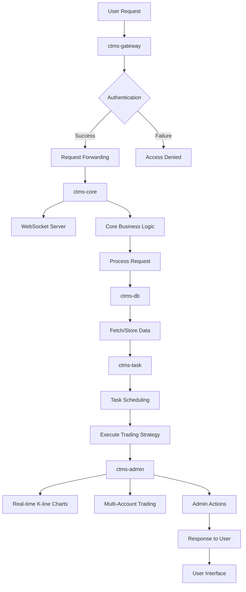

### Flowchart Description:
1. **User Request**: The process begins with a user sending a request to the system.
2. **ctms-gateway**:
   - The request first undergoes **Authentication** to verify the user's identity.
   - If authentication is **successful**, the request is forwarded to `ctms-core`.
   - If authentication **fails**, an "Access Denied" response is returned.
3. **ctms-core**:
   - Manages the core business logic of the system.
   - Utilizes the **WebSocket Server** for real-time communication.
   - Processes the request further and sends it to `ctms-db` and `ctms-task`.
4. **ctms-db**:
   - Handles data retrieval and storage operations.
5. **ctms-task**:
   - Schedules tasks and executes quantitative trading strategies.
6. **ctms-admin**:
   - Provides features such as real-time K-line charts and multi-account trading.
   - Performs administrative actions like data backup and system configuration.
7. **Response to User**:
   - The final processed result is sent back to the user through the user interface.

# Futures

1. Display real-time K-line;
   - [x] OKX
   - [x] Binance
   - [x] Bybit
2. Real-time trading, position information, pending orders and account assets display;
   - [x] OKX
   - [x] Binance
   - [ ] Bybit
3. Featured indicator display;
4. Show Micro Strategy BTC position;
5. Show Trump WLFI fund position;
6. Display real-time funding rate;
7. Visual tracking of account assets.

# Page display

| 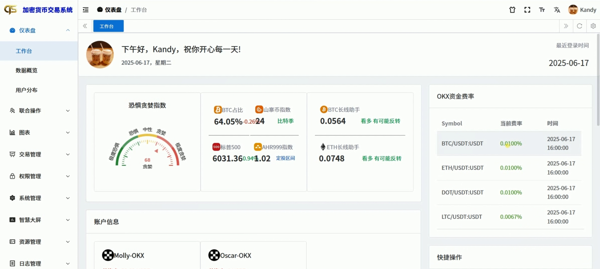 | 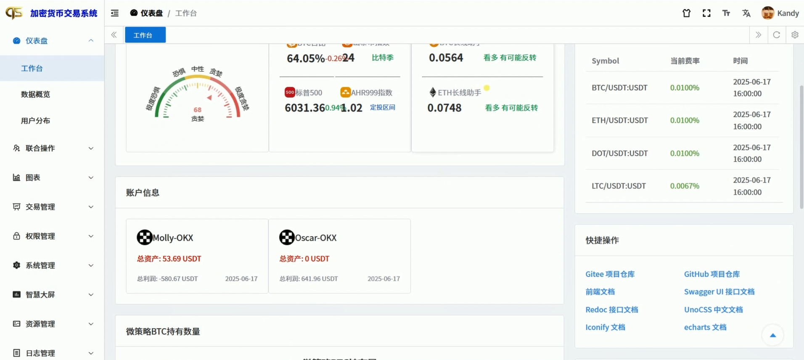      |
| ----------------------------------- | ---------------------------------- |
| 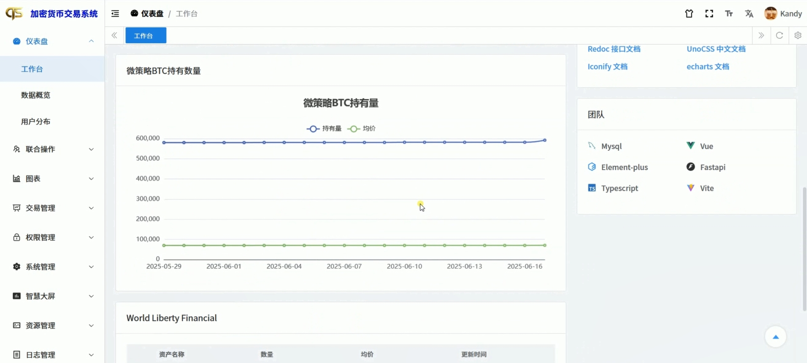      | 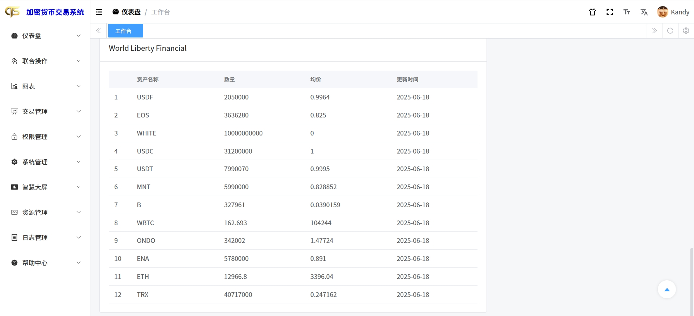         |
| 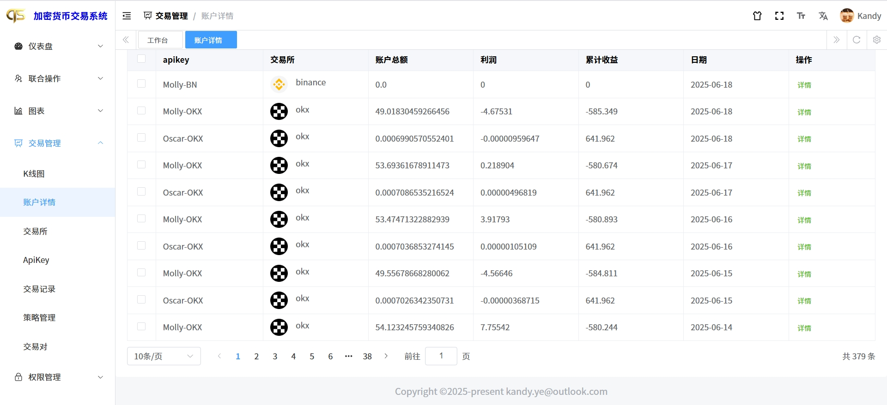    | 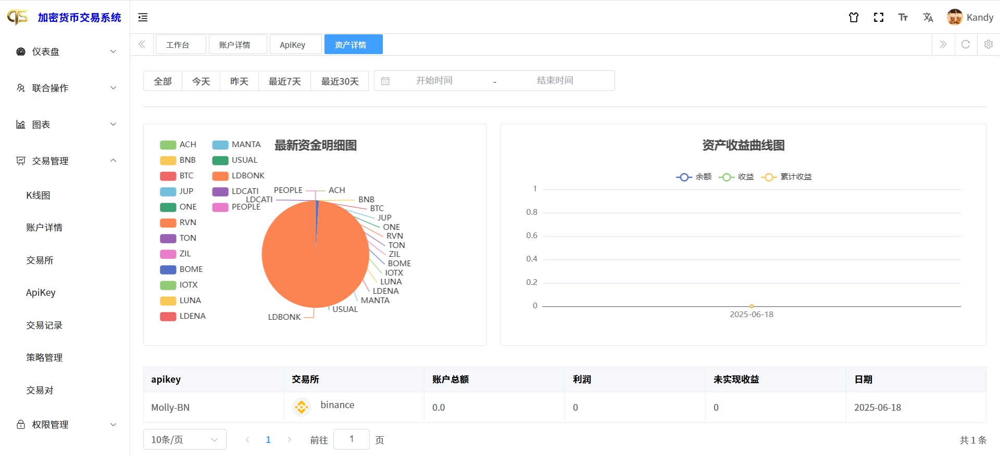 |
| 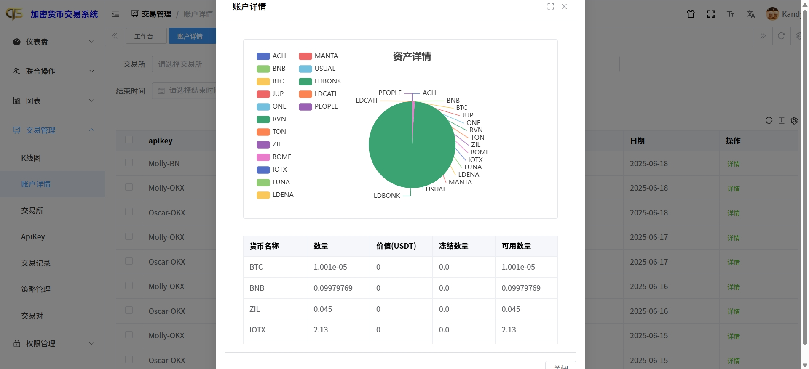    | 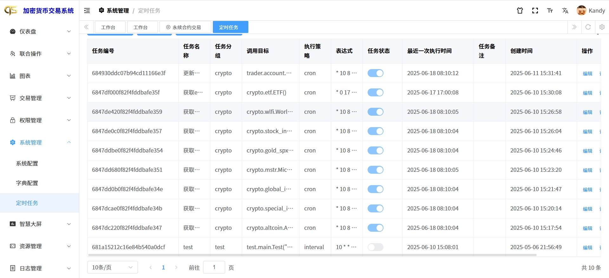       |
| 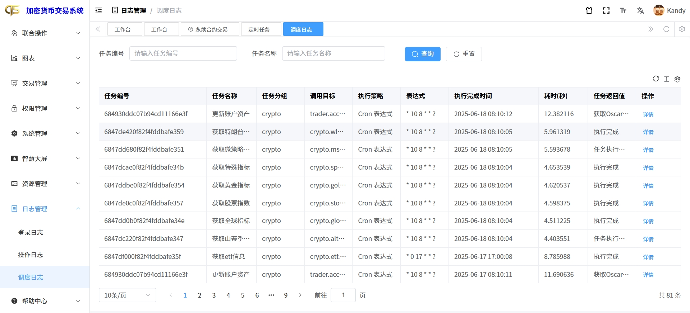       | 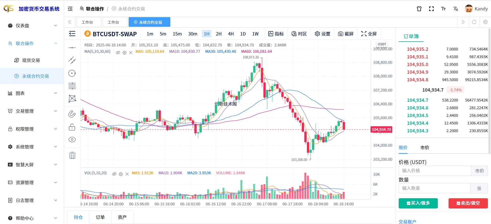     |
| 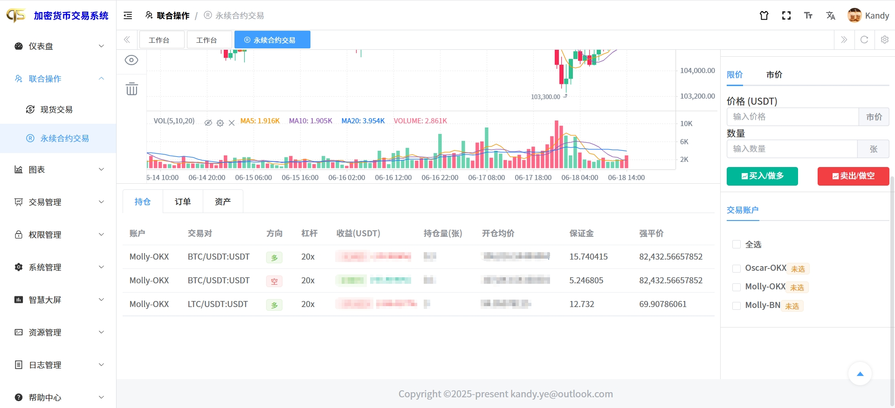      | 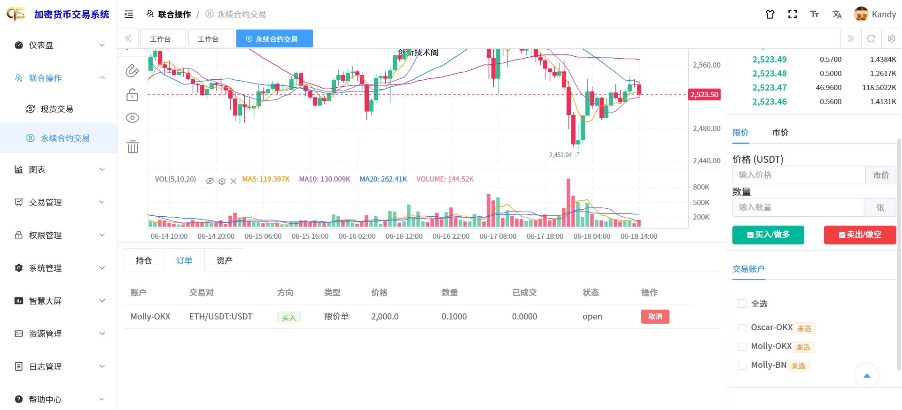      |
| 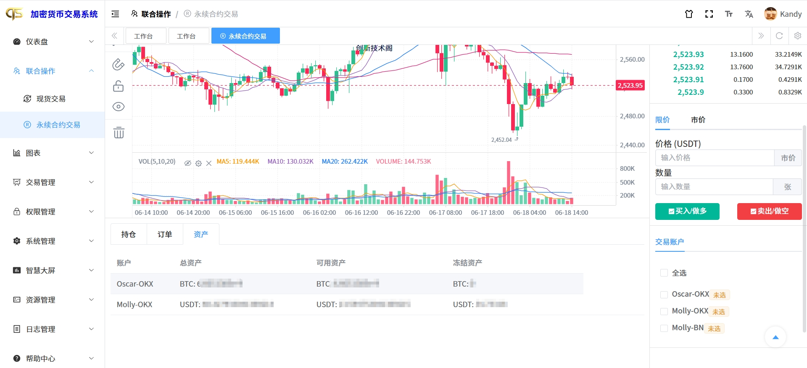      | 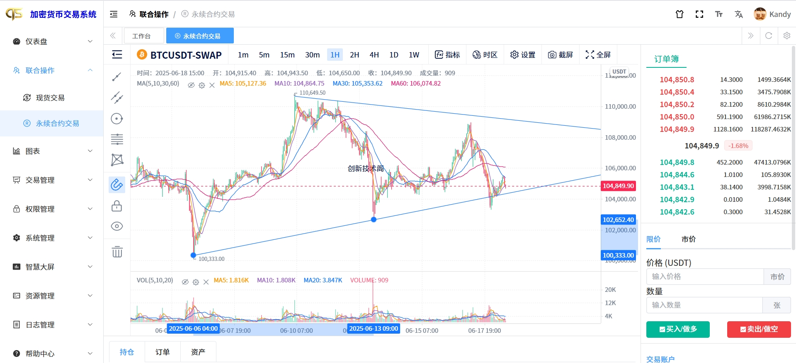            |

# Video

[Youtube video](https://www.youtube.com/watch?v=jjR2XFd25Wc)

# 🍩 Donate

If you find CryptoArbitrage is useful and would like to support its development, consider making a donation. Your contributions will help cover the costs of maintaining and improving this project.

**Donate via:**

- **Bitcoin (BTC):** `bc1qglw0rcamd688gacnc7fetvw4xjj933e2zn0unz`
- **Ethereum (ETH):** `0xcdF5dea9B6467A1BcBcC793B9dB5CF443Be2c5D6`

Thank you for your support!

# 👋🏻 Communication

👥 Communicate with developers, request features, and receive support. Follow me on [Telegram](https://t.me/KandyYe).

